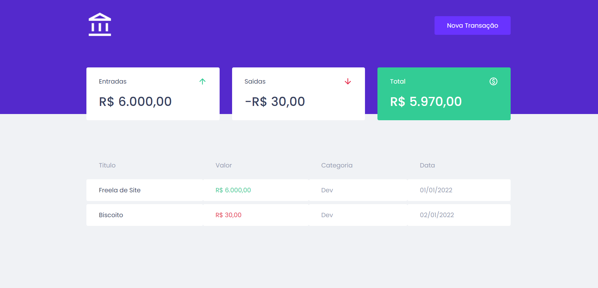
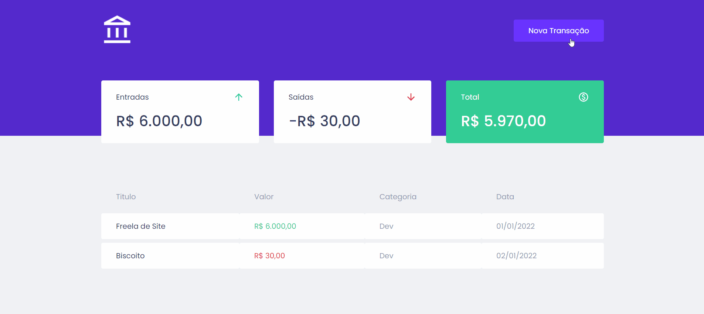

  <h1>RV Money</h1>
  

    Plataforma de gerenciamento financeiro
  

  

## Sobre o projeto 💻 

Projeto criado durante o módulo de React do curso Ignite, o projeto tem como objetivo realizar um controle financeiro de cadastro de despesas e rendas.

## Objetivos 🎯

- Utilização do figma para compor o desing
- Utilização de Hooks
- Utilização de contexto

## Tecnologias 🧑🏾‍💻

## Bibliotecas de Suporte 🤝🏾

- [MirageJS](https://miragejs.com/)
  - O Mirage JS é uma biblioteca de simulação de API que permite criar, testar e compartilhar um aplicativo JavaScript completo e funcional sem precisar depender de nenhum serviço de back-end. Utilizei esta biblioteca para criação da API simulada onde as transações são feitas.

- [Axios](https://axios-http.com/ptbr/docs/intro)
  - Axios é um cliente HTTP baseado-em-promessas para o node.js e para o navegador. Utilizado aqui para ligar o front a API.

- [React modal](https://www.npmjs.com/package/react-modal)
  - Biblioteca utilizada na criação do modal que é exibido ao clicar em "Nova Transação".

- [Styled components](https://styled-components.com/)
  - Biblioteca para criação de componentes estilizados utilizando css in js.

- [Polished](https://polished.js.org/)
  - Biblioteca utilizada para os efeitos de escurecer dos botões ao passar o mouse em cima, ela utiliza a cor inserida e pode tanto escurecer a cor informada como também clarear.

## Ferramentas 🛠️

## APP 

## Executando o projeto

No diretório raiz do projeto execute:

- Para instalar as dependências ``yarn``
- Para iniciar o projeto ``yarn start``
  

Copyright © 2022  <a href="https://github.com/Rogerio0Vieira"> Rogério Vieira</a>

